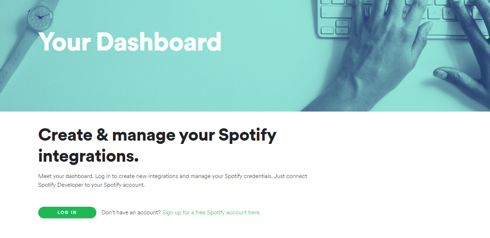
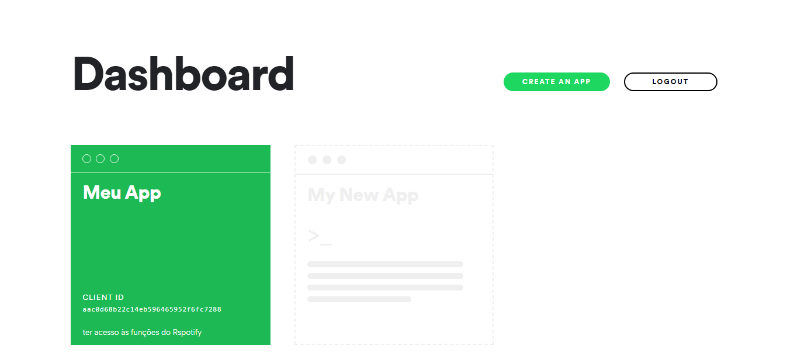
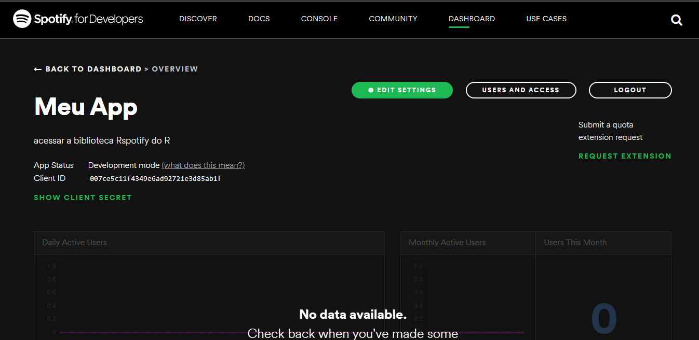
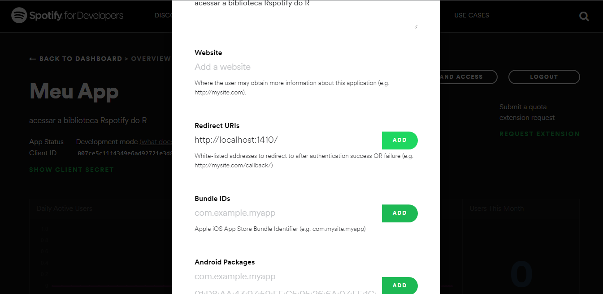
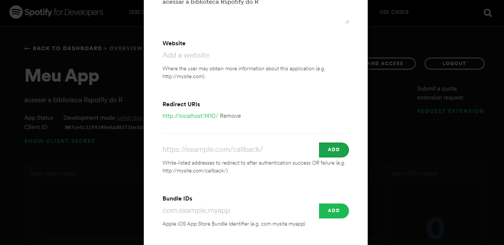
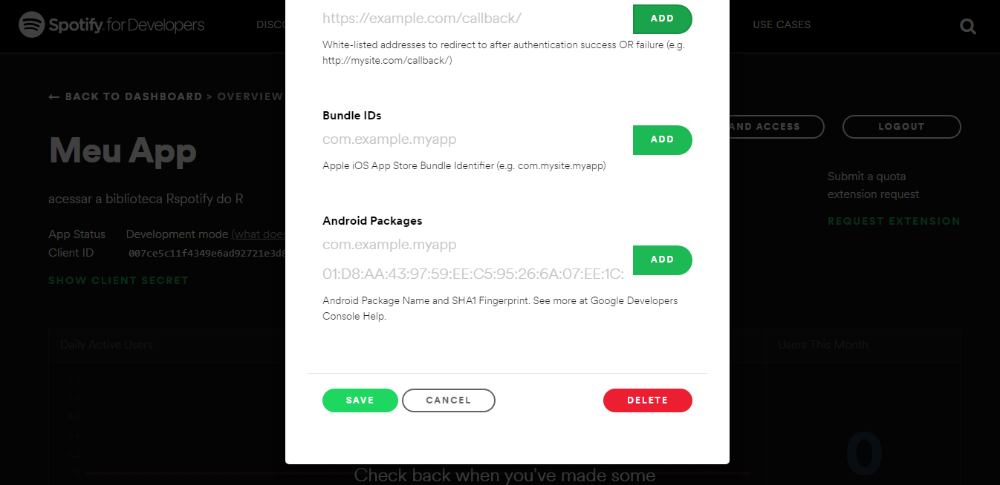

Olá! Quem me conhece sabe que sou um pouco viciada em música, e no contexto do R não seria diferente! hahaha 

Já faz um tempo que estou mexendo com a API do Spotify através do R. Inicialmente comecei com o pacote Rspotify, e depois conheci o spotifyr (e foi aí que pirei de vez, descobri que dá pra fazer absolutamente tudo pelo R: criar playlists, adicionar músicas em playlists, ver quais foram as minhas últimas músicas escutadas, e tudo mais que você imaginar). 

Como o acesso a esses pacotes não é nada trivial, resolvi fazer esse post para mostrar de uma vez por todas como isso é feito (como obter o tão ... token de acesso do Spotify, e mostrar como funcionam algumas funções)

Nesse post, vou falar só sobre o pacote Rspotify, mas pretendo fazer outro post focado no spotifyr mais pra frente.

Então, vamos lá:

## Obtendo token de acesso do Spotify

Primeiro, instale o pacote Rspotify através do comando

```{r eval=FALSE}
install.packages("Rspotify")
```

Agora, carregue o pacote

```{r}
library(Rspotify)
```

Note que todas as funções do Rspotify exigem o argumento "token".

Para obter esse token, siga os seguintes passos:

(obs: estou assumindo que você já possui uma conta no Spotify. Ela não precisa ser premium, então caso não possua, é só criar uma)

1 - Entre [nesse link](https://developer.spotify.com/dashboard/)

Você será redirecionado para essa página:

```{r, fig.align='center', echo = FALSE}

```

2 - Clique em "Log in" e faça o login com a sua conta do spotify

3 - Agora, clique em "Create an app"

```{r, fig.align='center', echo = FALSE}

```

4 - Dê um nome e uma descrição para o seu app, assinale a caixinha de Termos de Uso, e então, clique em "Create"

```{r, fig.align='center', echo = FALSE}
knitr::include_graphics("static/images/posts/conteudo/2022-06-28-rspotify/rspotify003.png")
```

5 - Depois de criar o app, você será redirecionado para essa tela. Clique em "edit settings"

```{r, fig.align='center', echo = FALSE}

```

6 - Preencha o campo "Redirect URIs" com  "http://localhost:1410/" (sem as aspas), e clique em "Add"

```{r, fig.align='center', echo = FALSE}

```

A tela deve ficar assim:

```{r, fig.align='center', echo = FALSE}

```

7 - Agora, role até o final da página e clique em "Save"

```{r, fig.align='center', echo = FALSE}

```

8 - Clique no botão "Show client secret"

```{r, fig.align='center', echo = FALSE}
knitr::include_graphics("static/images/posts/conteudo/2022-06-28-rspotify/rspotify008.png")
```

Veja que na tela estão o "Client ID" e o "Client Secret". São esse dois tokens que usaremos para ter acesso às funções do Rspotify.

Agora, com o R aberto e o pacote Rspotify carregado, rode o seguinte código (substituindo o segundo e terceiro argumentos pelo Client ID e Client Secret, respectivamente. O primeiro argumento é livre):

```{r eval=FALSE}
keys <- spotifyOAuth("nome_qualquer_aqui",
                     "cole_aqui_seu_client_id",
                     "cole_aqui_seu_client_secret")
```

obs: todos os argumentos são do tipo character, então devem ficar entre aspas.


Você será redirecionado para uma página de autorização do Spotify no seu navegador. Clique em "Aceito", e volte ao R. 

Pronto! Agora é só usar as funções do Rspotify, usando 'token = keys' como argumento em todas elas.

## Conhecendo as funções do Rspotify


