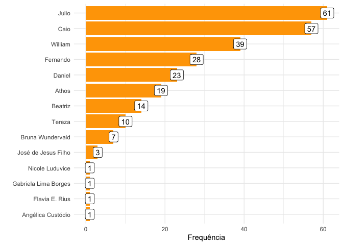
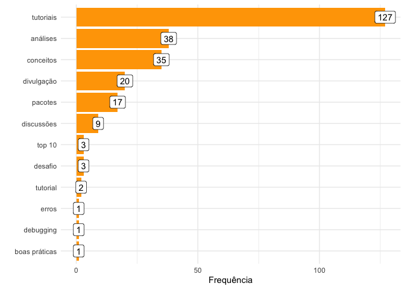
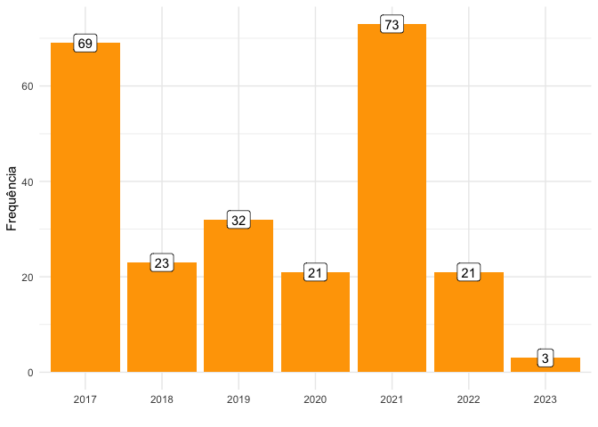
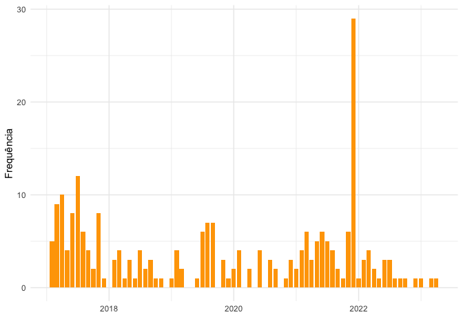
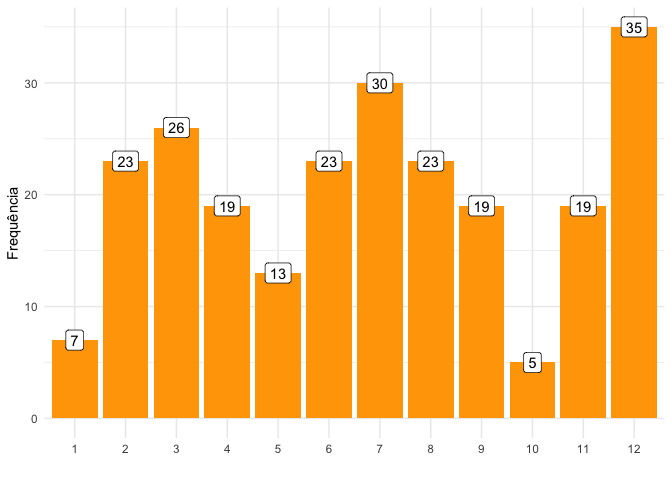
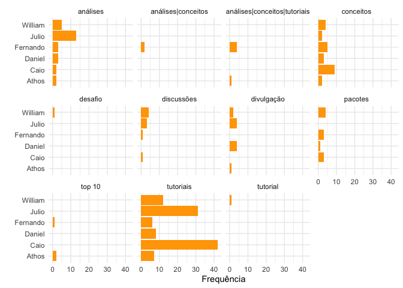

<!-- README.md is generated from README.Rmd. Please edit that file -->

## Número de posts: 242

## Por autoria

<!-- -->

## Por categoria

<!-- -->

## Por ano

<!-- -->

## Por mês/ano

<!-- -->

## Por mês

<!-- -->

## Autoria vs categoria

<!-- -->

## Posts aposentados

| date       | title                                                             | author               |
|:-----------|:------------------------------------------------------------------|:---------------------|
| 2017-04-01 | Multas em São Paulo                                               | Daniel               |
| 2017-05-04 | Gráficos miojo: Mapas temáticos do Brasil em 3 minutos ou menos   | Fernando             |
| 2017-06-17 | Skimr: estatísticas básicas com ❤️                                | Julio                |
| 2017-06-19 | bR Bloggers está no ar                                            | Daniel               |
| 2017-07-31 | Quebrando CAPTCHAs - Parte IV: Trabalhando com a imagem completa  | Julio                |
| 2017-07-10 | Quebrando CAPTCHAs - Parte II: O pacote decryptr                  | Julio                |
| 2017-07-22 | Quebrando CAPTCHAs - Parte III: Segmentação de imagens            | Julio                |
| 2017-09-02 | Comportamentos imprevisíveis do lubridate                         | Fernando             |
| 2017-11-03 | Estatística e Música                                              | Julio                |
| 2017-11-12 | Quebrando Captchas - Parte V: Fazendo redes convolucionais na mão | Julio                |
| 2017-11-20 | Pacote reticulate                                                 | Gabriela Lima Borges |
| 2018-05-30 | pesqEle: dados de pesquisas eleitorais                            | Julio                |
| 2020-08-27 | Aplauda-me                                                        | Julio\|Athos         |
