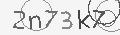
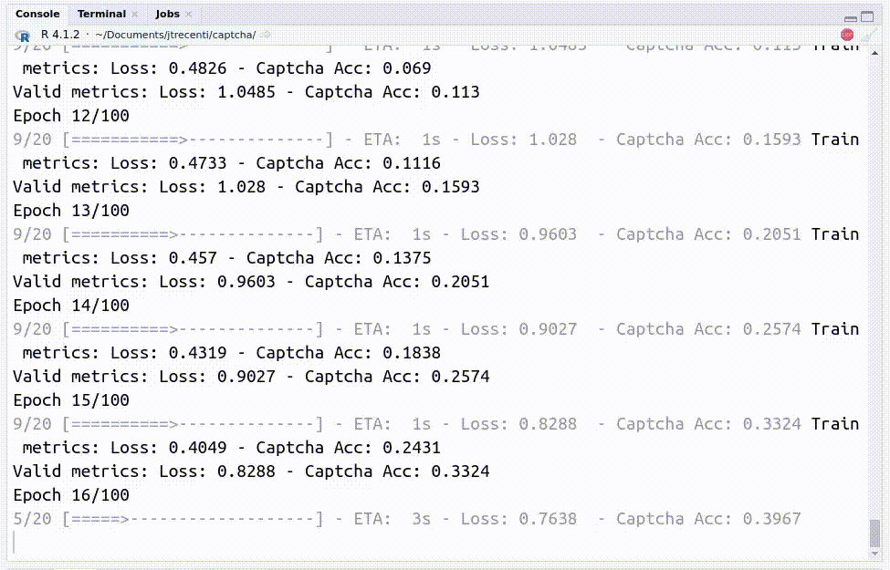

```{r setup, include=FALSE}
knitr::opts_chunk$set(
  collapse = TRUE
)
```

Sabe aquelas imagens que aparecem quando você está preenchendo um formulário ou quer acessar uma página específica, pedindo para você decifrar o texto? Isso é o que chamamos de CAPTCHA (**Completely Automated Public Turing test to tell Computers and Humans Apart**).


<div style="width:70%;margin:auto;">

</div>

<center>Figura: Exemplo de captcha do site do Tribunal Regional do Trabalho (TRT).</center>


O Captcha é um desafio computacional criado para ser difícil de resolver por máquinas mas fácil de resolver por pessoas. No início, a maioria dos Captchas eram formados por letras aleatórias inseridas em imagens ou áudios com algum ruído. Com a popularização das técnicas de Deep Learning, esses desafios se tornaram fáceis de resolver por máquinas, desde que exista uma base suficientemente grande de exemplos classificados.

Em posts anteriores aqui do blog, eu mostrei como resolvemos Captchas na mão ou usando redes neurais convolucionais. Todos esses posts usavam o `{keras}` como backend, que era a tecnologia de deep learning que eu conhecia na época.

> Observação: alguns dos posts anteriores de Captchas não estão visíveis. Algum dia vou revivê-los!

Neste post, vou mostrar como resolver um Captcha de texto em imagem usando o pacote `{luz}`. O pacote surgiu para facilitar a vida de quem constrói modelos de Deep Learning usando o `{torch}`.

## O que é {torch}? O que é {luz}?

O `{torch}` é um pacote do R criado pelo nosso sócio [Daniel Falbel](https://github.com/dfalbel), que também trabalha na RStudio. O pacote é uma adaptação do `pytorch`, biblioteca de python muito popular para fazer contas de álgebra matricial e diferenciação automática utilizando GPUs, que são os principais ingredientes utilizados na construção e ajuste de modelos de Deep Learning. A empresa por trás do projeto Torch é o Facebook (Meta?).

<div style="max-width:200px;margin:auto;">


</div>

A dificuldade do pacote `{torch}` para pessoas que estão começando é a complexidade da sintaxe. A ferramenta é super flexível, permitindo o ajuste de modelos customizados, mas a construção desses modelos está longe de ser trivial. Por exemplo, é comum precisar implementar os passos de atualização dos parâmetros manualmente a partir de algumas funções básicas do pacote.

O pacote `{luz}` -- sim, o nome é uma brincadeira com a luz que sai de uma tocha... 🥁 -- vem com a ideia de facilitar um pouco esse processo. Para conseguir rodar um modelo de deep learning usando o luz, precisamos de apenas i) um dataset/dataloader construído para gerar amostras das bases de dados de treino/validação e ii) um modelo, que deve ser um módulo do torch. 

<div style="max-width:200px;margin:auto;">


</div>

Vamos investigar os elementos do luz a seguir. Como exemplo, utilizaremos os nossos queridos Captchas, para não ficar na mesmisse do MNIST 😉

O exemplo da vez será o TRT, pois a base é pequenininha e é um Captcha relativamente fácil de resolver.

```{r include=FALSE}

```

<div style="min-width:200px;margin:auto;">


</div>

## Dados, datasets e dataloaders

Uma característica importante de modelos de deep learning é que as bases de dados costumam ser bem grandes. Por isso, foram desenvolvidas técnicas que atualizam os parâmetros do modelo com base apenas em uma amostra dos dados, sem a necessidade de carregar todas as observações na memória do computador. Essa estratégia parece um pouco estranha de início, mas existem muitos estudos que demonstram que elas não só funcionam como também têm chances de trazer propriedades de regularização ao modelo.

Nesse contexto surgem os `dataset()`s e `dataloader()`s do torch. O dataset é um objeto responsável por informar como uma base de dados deve ser acessada (por exemplo, lendo uma imagem, um arquivo csv ou um áudio), e de que forma podemos obter um item dessa base. O dataset é um objeto de classe R6, que é uma espécie de orientação a objetos do R desenvolvida pela RStudio.

Abaixo, temos o esqueleto de um dataset do torch:

```{r dataset, eval=FALSE}
# isso cria um dataset generator
ds_generator <- torch::dataset(
  name = "meu nome!",
  objeto_arbitrario = "você pode criar objetos arbitrários aqui",
  
  # isso é rodado quando você cria o dataset(), com parâmetros
  initialize = function(parametro1, parametro2, repeticoes) {
    # código arbitrário
    dados <- matrix(
      c(parametro1, parametro2),
      ncol = 2, nrow = repeticoes, byrow = TRUE
    )
    ## registra os dados para ser usado em outro lugar
    self$dados <- dados
  },
  
  # função que pega um item da base
  .getitem = function(index) {
    self$dados[index, ]
  },
  
  # função que mede o tamanho da base
  .length = function() {
    nrow(self$dados)
  }
)

# para criar o dataset mesmo:

ds <- ds_generator("ola", "mundo", 5)
```

    <meu nome!>
      Inherits from: <dataset>
      Public:
        .getitem: function (ii) 
        .length: function () 
        clone: function (deep = FALSE) 
        dados: ola ola ola ola ola mundo mundo mundo mundo mundo
        initialize: function (parametro1, parametro2, repeticoes) 
        objeto_arbitrario: você pode criar objetos arbitrários aqui

Os objetos registrados podem ser acessados dessa forma:

```{r dataset-show, eval=FALSE}
ds$dados
```
Legal! agora temos nosso dataset. Agora precisamos de um método para gerar amostras desse dataset. Esse é o __dataloader__, que pode ser criado assim:

         [,1]  [,2]   
    [1,] "ola" "mundo"
    [2,] "ola" "mundo"
    [3,] "ola" "mundo"
    [4,] "ola" "mundo"
    [5,] "ola" "mundo"

```{r dataloader, eval=FALSE}
dl <- torch::dataloader(ds, batch_size = 2)
dl
```

    <dataloader>
      Public:
        .auto_collation: active binding
        .dataset_kind: map
        .has_getbatch: FALSE
        .index_sampler: active binding
        .iter: function () 
        .length: function () 
        batch_sampler: utils_sampler_batch, utils_sampler, R6
        batch_size: 2
        clone: function (deep = FALSE) 
        collate_fn: function (batch) 
        dataset: meu nome!, dataset, R6
        drop_last: FALSE
        generator: NULL
        initialize: function (dataset, batch_size = 1, shuffle = FALSE, sampler = NULL, 
        multiprocessing_context: NULL
        num_workers: 0
        pin_memory: FALSE
        sampler: utils_sampler_sequential, utils_sampler, R6
        timeout: -1
        worker_globals: NULL
        worker_init_fn: NULL
        worker_packages: NULL

Isso pode ser usado para gerar amostras da base de dados, o que é importante para a etapa de ajuste de modelos realizadas pelo `{torch}` e pelo `{luz}`. 

No caso dos captchas, eu montei uma função do pacote `{captcha}` que cria os dataloaders de treino e validação a partir de uma função que faz o download dos arquivos brutos.

```{r dataloader-all, eval=FALSE}

path <- "caminho/para/arquivos/brutos"

# cria o dataset. No caso, estamos usando a base do TRT, 
# que tem apenas 400 Captchas.

captcha_ds <- captcha::captcha_dataset(
  root = "data-raw/trt",
  captcha = "trt2",
  download = TRUE
)


# cria os dataloaders de treino e validação

## amostra de indices
id_train <- sample(1:length(captcha_ds), .8 * length(captcha_ds))

## cria o dataloader de treino
captcha_dl_train <- torch::dataloader(
  torch::dataset_subset(captcha_ds, id_train),
  batch_size = 32,
  shuffle = TRUE
)

## cria o dataloader de validação
captcha_dl_valid <- torch::dataloader(
  torch::dataset_subset(captcha_ds, -id_train),
  batch_size = 32
)
```

## Modelo

Um modelo do torch também é um objeto de classe R6, mas que precisa ter os parâmetros `initialize=` e `forward=` implementados. Aqui um exemplo que soma um número ao valor de entrada:

```{r model, eval=FALSE}
model_generator <- torch::nn_module(
  "meu modelo!",
  # aqui inicializamos nosso modelo
  initialize = function(parametro) {
    self$valor <- parametro
  },
  # aqui calculamos o que o modelo deve calcular
  forward = function(x) {
    x + self$valor
  }
)

model_generator
```

    <meu modelo!> object generator
      Inherits from: <inherit>
      Public:
        .classes: meu modelo! nn_module
        initialize: function (parametro) 
        forward: function (x) 
        clone: function (deep = FALSE) 
      Parent env: <environment: 0x5594bc41f3c0>
      Locked objects: FALSE
      Locked class: FALSE
      Portable: TRUE

Por exemplo, o modelo abaixo somará 10 ao valor de entrada

```{r model-show, eval=FALSE}
modelo <- model_generator(10)
modelo(1)
```

    [1] 11

No nosso caso, utilizaremos um modelo já implementado no pacote `{captcha}`, que utiliza redes neurais convolucionais. É importante mencionar que não é necessário criar o modelo: utilizaremos apenas o model generator.

```{r model-example, eval=FALSE}
captcha::net_captcha
```

    <CAPTCHA-CNN> object generator
      Inherits from: <inherit>
      Public:
        .classes: CAPTCHA-CNN nn_module
        initialize: function (input_dim, output_ndigits, output_vocab_size) 
        forward: function (x) 
        clone: function (deep = FALSE) 
      Parent env: <environment: 0x557dc107da60>
      Locked objects: FALSE
      Locked class: FALSE
      Portable: TRUE


## Treino

E agora chegamos na parte mais legal. Com o `{luz}`, temos uma sintaxe parecida com o `{keras}`, em que fazemos o setup do modelo e depois ajustamos, com direito a uma barrinha de progresso que já vem automaticamente 🤩


```{r model-run, eval=FALSE}
fitted <- captcha::net_captcha |>
  # aqui colocamos a função de perda e o otimizador
  luz::setup(
    loss = torch::nn_multilabel_soft_margin_loss(),
    optimizer = torch::optim_adam
  ) |>
  # aqui nós colocamos os hiperparâmetros do modelo
  # no caso, precisamos passar informações sobre a dimensão
  # da imagem, o tamanho do vocabulário e a quantidade de letras
  # em um captcha
  luz::set_hparams(
    input_dim = dim(captcha_ds$data)[-1],
    output_vocab_size = dim(captcha_ds$target)[3],
    output_ndigits = dim(captcha_ds$target)[2]
  ) |>
  # aqui nós colocamos os hiperparâmetros de otimização
  luz::set_opt_hparams(
    lr = .1
  ) |>
  # ajustar o modelo
  luz::fit(
    captcha_dl_train,
    valid_data = captcha_dl_valid,
    epochs = 30
  )
```

E pronto! Agora é só ver o modelo rodar e mexer nos hiperparâmetros para que o modelo alcance a acurácia desejada.

## Extra: métrica customizada

Uma coisa que ficou faltando no código anterior é uma ideia de como fica a acurácia do modelo ao longo do ajuste. Como não existe uma métrica já pronta para calcular o quanto acertamos das 6 letras ao mesmo tempo, precisamos implementar uma métrica customizada para o Captcha.

Isso não é um grande desafio para o `{luz}`! Assim como nos datasets e modelos, podemos criar uma métrica com uma classe R6, usando a função `luz::luz_metric()`. Essa classe deve ter 4 elementos: `abbrev=`, o nome da métrica, `initialize=` que seta os parâmetros iniciais, `update=` que atualiza a métrica a partir de um conjunto novo de outputs e predições e `compute=` que calcula a métrica atualizada. 

No caso dos Captchas, a métrica fica assim:

```{r, eval=FALSE}
captcha_accuracy <- luz::luz_metric(
  abbrev = "Captcha Acc",
  initialize = function() {
    # inicializa os parâmetros
    self$correct <- 0
    self$total <- 0
  },
  update = function(preds, target) {
    # extraímos o token com maior probabilidade associada, para cada letra
    pred <- torch::torch_argmax(preds, dim = 3)
    # fazemos o mesmo para a variável resposta
    tgt <- torch::torch_argmax(target$squeeze(), dim = 3)
    # comparamos os dois resultados e somamos a quantidade de resultados iguais
    new_correct <- (pred == tgt)$to(dtype = torch::torch_float())$sum()$item()
    # atualizamos os valores
    self$correct <- self$correct + new_correct
    self$total <- self$total + pred$numel()
  },
  compute = function() {
    # calcula a proporção de acertos
    self$correct / self$total
  }
)
```

## Resultados

O código completo de ajuste do modelo pode ser encontrado [aqui](). A sintaxe do pacote `{captcha}` ainda está instável, então pode ser que o código quebre no futuro.

```{r include=FALSE}



```


Com o código, consegui chegar em uma acurácia de 90% com apenas 400 exemplos classificados!

## Wrap-up

Neste post, vimos que

- O pacote `{luz}` é uma alterativa ao `{keras}` que usa o `{torch}` como backend.
- Para trabalhar com o `{luz}`, é necessário criar datasets, dataloaders e modelos na forma de classes R6.
- Com o `{luz}`, é possível criar métricas customizadas para acompanhar o desempenho de um modelo.
- Os modelos de redes neurais convolucionais funcionam bem em tarefas de visão computacional, como os Captchas.

É isso. Happy coding ;)
